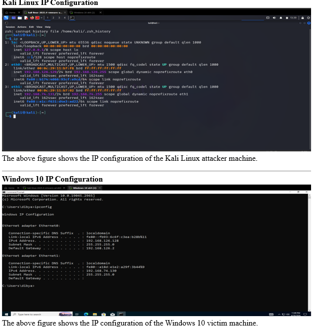
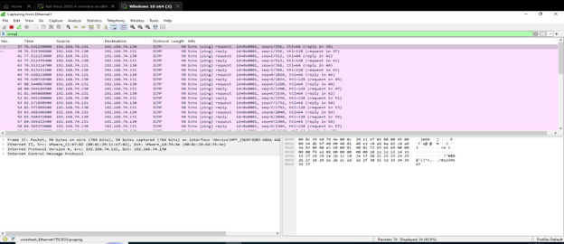
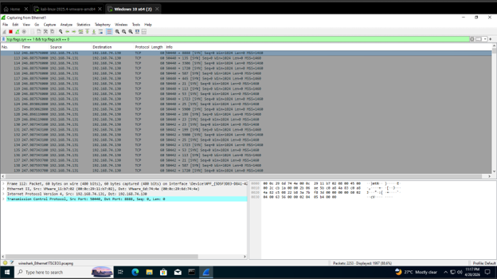
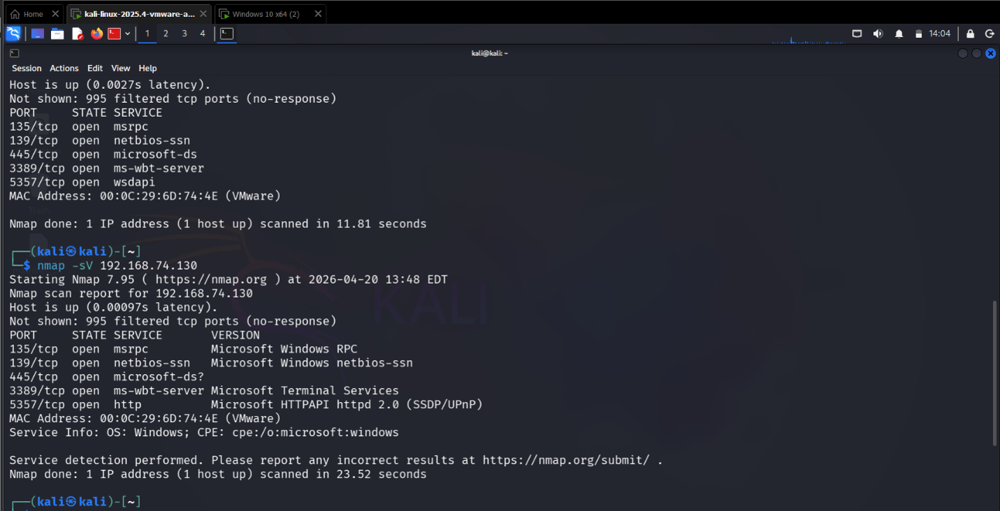
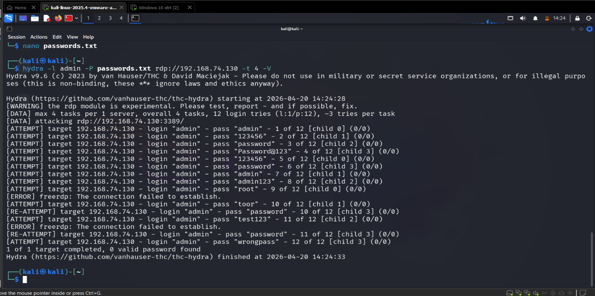
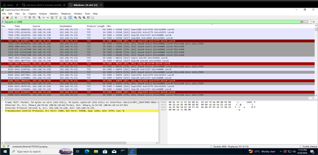

<div align="center">

# 🌐 SOC-Based Network Attack Detection & Traffic Analysis

### Wireshark • Nmap • Hydra • VMware • MITRE ATT&CK


**A hands-on Blue Team investigation demonstrating reconnaissance detection, port scanning analysis, brute-force attack simulation, and packet-level traffic analysis in an isolated VMware lab.**

</div>

---

# 📖 Project Overview

## Objective

The purpose of this project was to simulate common network attacks inside an isolated VMware lab and investigate the generated traffic from a Security Operations Center (SOC) perspective.

The project focuses on identifying attacker behavior through packet analysis, recognizing indicators of compromise (IOCs), and understanding how reconnaissance and brute-force attacks appear on the network.

---

## Attack Scenarios

The following attack techniques were simulated during this investigation:

- 🔍 ICMP Host Discovery
- 🌐 TCP SYN Port Scanning
- 📡 Service Enumeration
- 🔐 RDP Brute Force Attack
- 📊 Network Traffic Capture
- 🛡️ SOC Investigation & Analysis

---

## Skills Demonstrated

- Network Traffic Analysis
- Packet Inspection
- Threat Hunting
- SOC Investigation Workflow
- MITRE ATT&CK Mapping
- Attack Chain Analysis
- Detection Engineering Fundamentals

---

# 🖥️ Lab Environment

This investigation was conducted inside an isolated VMware Workstation lab to safely simulate attacker activity and analyze network traffic without affecting production systems.

---

## 🏗️ Lab Topology

```text
                    VMware Workstation
┌──────────────────────────────────────────────────────┐

        Kali Linux (Attacker)
        IP: 192.168.74.xxx
               │
               │
      ICMP • Nmap • Hydra
               │
               ▼
        Windows 10 (Victim)
        IP: 192.168.74.xxx
               │
               │
      Network Traffic
               │
               ▼
          Wireshark Capture
               │
               ▼
      SOC Investigation & Analysis

└──────────────────────────────────────────────────────┘
```

---

## 💻 Machines Used

| Machine | Purpose |
|---------|---------|
| Kali Linux | Attacker Machine |
| Windows 10 | Victim Machine |
| VMware Workstation | Virtual Lab Environment |
| Wireshark | Network Packet Capture & Analysis |

---

# 🛠️ Tools & Technologies

| Tool | Role in Investigation |
|------|------------------------|
| 🦈 Wireshark | Captured and analyzed network packets generated during the simulated attacks |
| 🐉 Kali Linux | Attacker machine used to perform reconnaissance and brute-force attacks |
| 🪟 Windows 10 | Victim machine targeted during the attack simulation |
| 🌐 Nmap | Performed host discovery, port scanning, and service enumeration |
| 🔓 Hydra | Simulated an RDP brute-force attack against the target |
| 💻 VMware Workstation | Hosted the isolated virtual lab environment |

---

## 🔧 Core Technologies

- TCP/IP Networking
- ICMP Protocol
- TCP SYN Scanning
- Remote Desktop Protocol (RDP)
- Packet Capture (PCAP)
- Network Traffic Analysis
- Threat Hunting
- SOC Investigation Workflow
- MITRE ATT&CK Framework

---

# ⚔️ Attack Timeline

This investigation followed the complete attack lifecycle from reconnaissance to brute-force activity. Each phase generated unique network artifacts that were captured and analyzed using Wireshark.

```text
┌──────────────────────────────┐
│ 1️⃣ Host Discovery            │
│ ICMP Echo Requests (Ping)     │
└──────────────┬───────────────┘
               │
               ▼
┌──────────────────────────────┐
│ 2️⃣ Port Scanning             │
│ Nmap TCP SYN Scan             │
└──────────────┬───────────────┘
               │
               ▼
┌──────────────────────────────┐
│ 3️⃣ Service Enumeration       │
│ Version Detection             │
└──────────────┬───────────────┘
               │
               ▼
┌──────────────────────────────┐
│ 4️⃣ RDP Discovery             │
│ Target Service Identification │
└──────────────┬───────────────┘
               │
               ▼
┌──────────────────────────────┐
│ 5️⃣ Brute Force Attack        │
│ Hydra Authentication Attempts │
└──────────────┬───────────────┘
               │
               ▼
┌──────────────────────────────┐
│ 6️⃣ Packet Capture            │
│ Wireshark Analysis            │
└──────────────┬───────────────┘
               │
               ▼
┌──────────────────────────────┐
│ 7️⃣ SOC Investigation         │
│ Detection & Findings          │
└──────────────────────────────┘
```

---

## 🎯 Investigation Goals

During each phase, the objective was to:

- Identify attacker behavior.
- Observe protocol-level communication.
- Capture packet evidence.
- Detect reconnaissance techniques.
- Analyze authentication attempts.
- Document indicators of compromise (IOCs).
- Map attacker activity to the MITRE ATT&CK framework.

---

# 🎯 MITRE ATT&CK Mapping

The observed attacker activities were mapped to the MITRE ATT&CK framework to better understand the tactics and techniques used during the investigation.

| Attack Activity | MITRE Technique | Technique ID | Detection Opportunity |
|-----------------|-----------------|--------------|-----------------------|
| ICMP Host Discovery | Network Service Discovery | T1046 | Monitor unusual ICMP traffic and host discovery patterns |
| TCP SYN Port Scan | Network Service Discovery | T1046 | Detect multiple SYN packets targeting different ports |
| Service Enumeration | Active Scanning | T1595 | Identify version detection and enumeration attempts |
| RDP Brute Force Attack | Password Guessing | T1110.001 | Correlate repeated failed authentication attempts |

---

## 🛡️ SOC Detection Opportunities

During the investigation, several opportunities for detection and monitoring were identified:

- Detect abnormal ICMP Echo Request activity.
- Monitor high-volume TCP SYN packets across multiple destination ports.
- Identify service enumeration attempts using Nmap.
- Correlate repeated RDP authentication failures with brute-force behavior.
- Generate alerts for suspicious reconnaissance activity before successful compromise.

---

## 📌 Key Takeaway

Mapping attacker behavior to the MITRE ATT&CK framework helps SOC analysts standardize detections, improve threat visibility, and develop more effective detection rules.

---

# 💻 Attack Execution Commands

The following commands were executed within the isolated VMware lab to simulate attacker activity. Each command generated network traffic that was captured and analyzed during the investigation.

---

## 🔍 ICMP Host Discovery

**Purpose:** Verify whether the target system is reachable on the network.

```bash
ping 192.168.74.130
```

**Expected Evidence**

- ICMP Echo Request packets
- ICMP Echo Reply packets
- Live host confirmation

---

## 🌐 TCP SYN Port Scan

**Purpose:** Discover open TCP ports without establishing a full TCP connection.

```bash
nmap -sS 192.168.74.130
```

**Expected Evidence**

- Multiple TCP SYN packets
- SYN/ACK responses from open ports
- Port scanning behavior

---

## 📡 Service Enumeration

**Purpose:** Identify services and versions running on discovered ports.

```bash
nmap -sV 192.168.74.130
```

**Expected Evidence**

- Service banners
- Version detection traffic
- Enumeration activity

---

## 🔐 RDP Brute Force Simulation

**Purpose:** Simulate repeated authentication attempts against the Remote Desktop service.

```bash
hydra -t 1 -V -f -l socuser -P passwords.txt rdp://192.168.74.130
```

**Expected Evidence**

- Multiple authentication attempts
- RDP communication
- Brute-force attack pattern
- Repeated failed logins

---

## 🎯 Investigation Objective

Each command was intentionally executed to generate identifiable network artifacts that could be captured, investigated, and correlated during a SOC investigation.

---

# 🔍 Wireshark Detection Filters

During the investigation, Wireshark display filters were used to isolate suspicious traffic and analyze attacker behavior at the packet level.

| Display Filter | Purpose | Detection Value |
|---------------|---------|-----------------|
| `icmp` | Display ICMP Echo Requests and Replies | Detect host discovery and reconnaissance activity |
| `tcp.flags.syn == 1 && tcp.flags.ack == 0` | Display TCP SYN packets | Identify TCP SYN port scanning behavior |
| `tcp.port == 3389` | Display Remote Desktop Protocol traffic | Investigate RDP communication and brute-force attempts |
| `tcp.port == 445` | Display SMB traffic | Monitor SMB communication and lateral movement opportunities |
| `http` | Display HTTP traffic | Analyze unencrypted web requests and responses |

---

## 🛡️ SOC Investigation Value

These filters enabled rapid identification of suspicious traffic by reducing background noise and focusing on attacker-generated network activity.

Using protocol-specific filters allows SOC analysts to:

- Detect reconnaissance activity.
- Investigate port scanning behavior.
- Identify authentication attempts.
- Correlate attacker actions across multiple protocols.
- Collect packet-level evidence for incident investigations.

---

## 📌 Analyst Note

Packet filtering is one of the most valuable skills in network security investigations. Efficient filtering reduces investigation time and helps analysts focus on indicators of compromise (IOCs) instead of manually reviewing thousands of packets.

---

# 🛡️ SOC Investigation Findings

The captured network traffic was analyzed from a Security Operations Center (SOC) perspective to identify attacker behavior, correlate network events, and determine potential detection opportunities.

---

## 🔎 Investigation Summary

### 1️⃣ Reconnaissance Activity Detected

Repeated **ICMP Echo Requests** were observed from the attacker system, confirming host discovery activity prior to further attacks.

**Evidence**

- Multiple ICMP Echo Requests
- Successful ICMP Echo Replies
- Live host confirmation

**Detection Opportunity**

Monitor abnormal ICMP traffic between internal hosts to identify reconnaissance activity.

---

### 2️⃣ TCP SYN Port Scanning Identified

Network traffic contained a high volume of **TCP SYN packets** targeting multiple destination ports.

This behavior is consistent with automated reconnaissance performed using **Nmap**.

**Evidence**

- SYN packets sent to multiple ports
- SYN/ACK responses from open services
- Sequential scanning behavior

**Detection Opportunity**

Alert on excessive SYN packets targeting multiple ports within a short time period.

---

### 3️⃣ Service Enumeration Confirmed

Version detection traffic revealed information about services exposed by the target system.

This information could be used by an attacker to identify vulnerable applications.

**Evidence**

- Service version detection
- Application banner collection
- Protocol fingerprinting

**Detection Opportunity**

Monitor for aggressive service enumeration originating from internal or external hosts.

---

### 4️⃣ Brute Force Authentication Attempts

Repeated authentication attempts against the RDP service were generated using **Hydra**.

The traffic pattern matched expected brute-force behavior.

**Evidence**

- Multiple RDP connection attempts
- Repeated authentication failures
- Consistent attack timing

**Detection Opportunity**

Correlate repeated failed authentication attempts and generate high-severity alerts.

---

### 5️⃣ Packet-Level Evidence Collection

Wireshark provided detailed visibility into every stage of the attack lifecycle.

Captured packets enabled reconstruction of attacker activity from reconnaissance through authentication attempts.

**Evidence**

- TCP Flags
- Source & Destination IP Addresses
- Port Numbers
- Protocol Details
- Packet Timing

---

## 🎯 Key Takeaways

- Reconnaissance activity was successfully detected.
- Port scanning behavior was clearly identified.
- Service enumeration exposed valuable system information.
- Brute-force attempts produced recognizable authentication patterns.
- Packet analysis enabled complete reconstruction of attacker activity.
- MITRE ATT&CK mapping improved understanding of attacker techniques.
- The investigation demonstrated how packet analysis supports SOC detection and incident response.

---

## 💡 SOC Analyst Insight

This investigation demonstrates that early-stage attacker behavior—such as reconnaissance and scanning—often provides the best opportunity for detection before a successful compromise occurs.

Building detections for these activities can significantly reduce attacker dwell time and improve an organization's defensive posture.

---

# 📸 Investigation Evidence

The following screenshots will be added after completing the repository setup. These images provide visual evidence supporting the investigation findings.

---

## 🖥️ Lab Topology





---

## 📡 ICMP Host Discovery





---

## 🌐 TCP SYN Port Scan




---

## 🔍 Service Enumeration





---

## 🔐 Hydra Brute Force Attack





---

## 🦈 Wireshark Packet Analysis





---

# 🚀 Defensive Recommendations & Future Improvements

The investigation highlighted several opportunities to improve detection capabilities and strengthen an organization's security posture.

---

## 🛡️ Defensive Recommendations

### Network Monitoring

- Continuously monitor ICMP traffic for reconnaissance activity.
- Detect abnormal TCP SYN scans targeting multiple ports.
- Alert on unexpected service enumeration from internal hosts.

---

### Authentication Security

- Enable Account Lockout Policies to reduce brute-force attempts.
- Implement Multi-Factor Authentication (MFA) for Remote Desktop access.
- Monitor repeated failed logon attempts and investigate anomalies.

---

### Network Hardening

- Restrict RDP access using firewall rules.
- Disable unnecessary services exposed to the network.
- Apply regular operating system and application security updates.

---

### Security Monitoring

- Forward Windows Security Logs to a SIEM platform such as Splunk.
- Develop detection rules for reconnaissance and brute-force activity.
- Correlate network traffic with endpoint authentication events.

---

## 📈 Future Improvements

The next version of this project will include:

- 🔹 Splunk SIEM integration for centralized log analysis.
- 🔹 Suricata IDS integration for network-based detection.
- 🔹 Sigma detection rules for reconnaissance and brute-force activity.
- 🔹 Automated detection scripts using Python.
- 🔹 Security dashboards for SOC monitoring.
- 🔹 MITRE ATT&CK Navigator mapping.
- 🔹 Incident response playbooks for detected attacks.

---

## 💡 SOC Analyst Insight

Effective security monitoring is not limited to detecting successful attacks.

Early detection of reconnaissance, scanning, and repeated authentication failures enables SOC teams to identify malicious activity before a system is compromised.

---

# 📄 Project Report

A detailed report documenting the complete investigation methodology, packet analysis, findings, and conclusions is included in this repository.

📥 **Download the full report:**

- 📄 [SOC-Based Network Attack Detection & Traffic Analysis Report](report/Network_Attack_Detection_Report.pdf)

---

# 📚 Skills Demonstrated

Through this project, the following SOC Analyst skills were practiced and demonstrated:

- Network Traffic Analysis
- Packet Capture & Inspection
- Reconnaissance Detection
- TCP SYN Scan Analysis
- Service Enumeration Analysis
- Brute-Force Attack Investigation
- Wireshark Packet Analysis
- Nmap Security Assessment
- Hydra Attack Simulation
- MITRE ATT&CK Mapping
- Security Monitoring
- Incident Investigation
- Technical Documentation

---

# ⚠️ Disclaimer

This project was developed in a controlled and isolated VMware lab environment for educational and defensive cybersecurity purposes only.

All attack simulations were performed on systems owned by or authorized for testing by the project author. The techniques demonstrated in this repository should never be used against systems without explicit permission.

---

# 👨‍💻 Author

**Dibyanshu Behera**

Aspiring SOC Analyst focused on:

- Blue Team Operations
- Security Monitoring
- Threat Detection
- Digital Forensics
- Incident Response
- Splunk SIEM
- Network Security

If you found this project helpful, consider giving the repository a ⭐.

---

<div align="center">

### 🛡️ Detect Early • Investigate Thoroughly • Defend Continuously

**Built as part of my SOC Analyst Portfolio**

</div>
